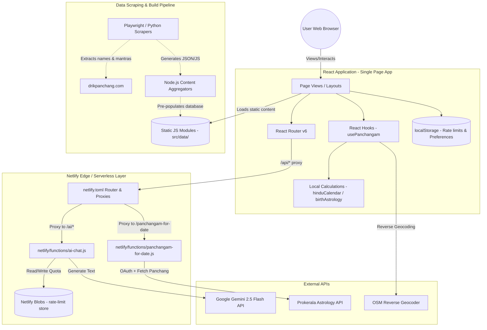
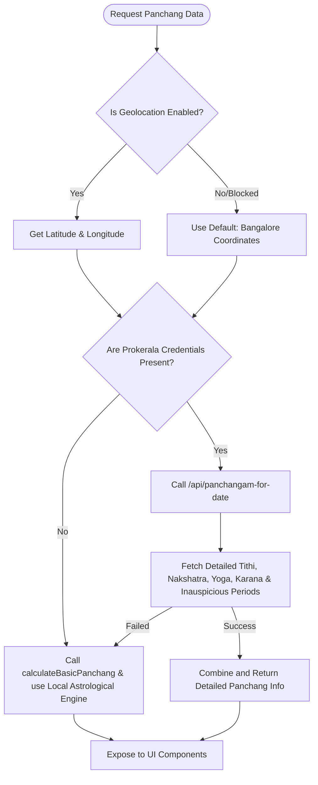
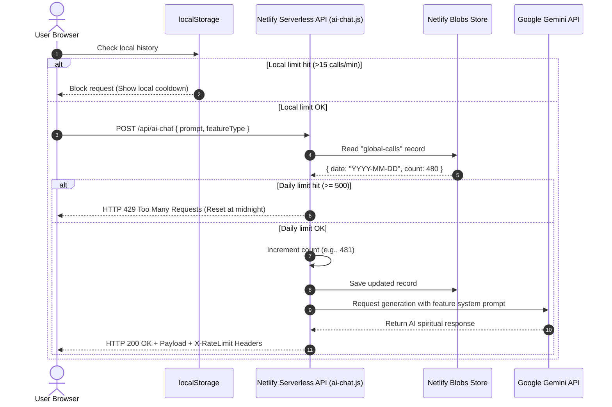

# DivinePath - Hindu Spiritual Companion & Calendar

DivinePath is a modern, premium web application designed to act as an interactive Hindu spiritual companion. It integrates calendar calculations (Panchangam), an offline-first library of sacred scriptures (Vedas, Upanishads, Puranas), customizable deity-focused chanting tools (Ashtottarams), and a suite of AI-driven spiritual features (chat, dream interpretation, baby name suggestions) powered by Google Gemini API.

---

## 1. System Architecture

The application is deployed on **Netlify**, utilizing **Netlify Serverless Functions** for backend routing and **Netlify Blobs** for daily quota persistence.



---

## 2. Core Functional Modules

### A. Hindu Calendar (Panchangam) & Muhurtas
The Panchang system operates on a hybrid model that balances API-driven accuracy with instant local mathematical fallbacks.

*   **Panchangam Hook ([usePanchangam.js](file:///Users/mallesh/DivinePath/src/hooks/usePanchangam.js))**: Detects browser geolocation. If denied/unsupported, it defaults to Bangalore coordinates. It calls the open-source library `@ishubhamx/panchangam-js`'s [Observer](file:///Users/mallesh/DivinePath/src/hooks/usePanchangam.js#L2) class to calculate accurate celestial alignments.
*   **Local Calculation Engine ([hinduCalendar.js](file:///Users/mallesh/DivinePath/src/utils/hinduCalendar.js))**: Functions as a zero-dependency local math engine.
    *   **Tithi**: Lunar day estimated based on day-of-year calculations.
    *   **Nakshatra**: Lunar mansion approximated mathematically.
    *   **Vara**: Weekday parsed from standard JS `Date`.
    *   **Paksha**: Shukla/Krishna division.
    *   **Muhurtas**: Auspicious (Brahma, Abhijit, Godhuli) and Inauspicious (Rahu Kalam, Yamagandam, Gulika Kaal) timings computed relative to calculated Sunrise/Sunset.
*   **Panchang API ([panchangam-for-date.js](file:///Users/mallesh/DivinePath/netlify/functions/panchangam-for-date.js))**: Serverless function serving precise astronomical parameters from the Prokerala API when credentials are provided.



### B. Personalized Astrology & Reminders
*   **Astrology Engine ([birthAstrology.js](file:///Users/mallesh/DivinePath/src/utils/birthAstrology.js))**:
    *   [calculateBirthNakshatra](file:///Users/mallesh/DivinePath/src/utils/birthAstrology.js#L194-L220): Evaluates a user's date of birth and calculates their birth Nakshatra, ruling deity, planetary influence, and element.
    *   [getPersonalizedGuidance](file:///Users/mallesh/DivinePath/src/utils/birthAstrology.js#L222-L276): Maps birth charts against the current day's alignments, highlighting favorable weekdays or planetary alignments.
*   **Personalization View ([PersonalizedDashboard.js](file:///Users/mallesh/DivinePath/src/pages/PersonalizedDashboard/PersonalizedDashboard.js))**: Merges personal charts, daily tasks, color of the day, and customized morning, daytime, and evening practice check-ins.

### C. Literature Library
The Literature system contains an offline-first repository of Hindu scriptures.
*   **Data Aggregation ([src/data/literature/](file:///Users/mallesh/DivinePath/src/data/literature/))**: Modules like [bhagavad_gita.js](file:///Users/mallesh/DivinePath/src/data/literature/bhagavad_gita.js) and [shiva_purana.js](file:///Users/mallesh/DivinePath/src/data/literature/shiva_purana.js) house the scriptural data.
*   **Structure**: Follows a strict recursive structure: `Text -> Section (Kanda / Parva / Mandala) -> Scene/Chapter`.
*   **Reading Experience**: 
    *   [BookLandingPage.js](file:///Users/mallesh/DivinePath/src/pages/BookLandingPage/BookLandingPage.js): Renders the interactive Table of Contents.
    *   [UniversalReaderPage.js](file:///Users/mallesh/DivinePath/src/pages/UniversalReaderPage/UniversalReaderPage.js): Features reader enhancements (font size modifications, theme presets like Sepia/Dark mode).

### D. Deities & Ashtottaram Chanting
Provides interactive tools for deity worship and chanting.
*   **Gods Directory ([GodsGalleryPage.js](file:///Users/mallesh/DivinePath/src/pages/GodsGalleryPage/GodsGalleryPage.js))**: Directory highlighting deity profiles, attributes, and lore.
*   **Interactive Chanting ([AshtottaramDetailPage.js](file:///Users/mallesh/DivinePath/src/pages/AshtottaramDetailPage/AshtottaramDetailPage.js))**: Houses a tap-to-chant digital tracker for the 108 names of deities. Includes:
    *   Sanskrit text, English transliteration, and English meanings.
    *   Visual progress tracker, sound cues, and a cumulative counter capping at 108.

### E. AI Spiritual Assistant (Gemini Integration)
The application includes AI features powered by Google's `gemini-2.5-flash` model. Queries are routed through a serverless function with a hybrid rate-limiting configuration.

#### Hybrid Rate Limiting Architecture
1.  **Client-Side Check**: Users are limited to **15 requests per minute** monitored locally via `localStorage` timestamp histories.
2.  **Server-Side Global Check**: Implemented in [ai-chat.js](file:///Users/mallesh/DivinePath/netlify/functions/ai-chat.js). It connects to **Netlify Blobs** to track global daily volume. The application caps calls to a hard budget of **500 requests per day** across all users.
3.  **Context Injection (System Prompts)**: The handler parses a `featureType` parameter and injects dedicated system context:
    *   `ask-guru`: Hindu scriptural guidance style.
    *   `dream-interpretation`: Symbolism interpreted via *Swapna Shastra*.
    *   `name-suggestion`: Formatted generation of 12 Sanskrit baby names with deity associations, Nakshatras, and spiritual definitions.
    *   `personalized-shloka`: Search and retrieval of Sanskrit verses with context translation.



---

## 3. Directory Structure

```
├── .github/
│   └── copilot-instructions.md          # AI instructions
├── netlify/
│   └── functions/
│       ├── ai-chat.js                    # Gemini endpoint with rate limits
│       └── panchangam-for-date.js        # Prokerala API connection
├── scripts/                              # Scrapers & maintenance utilities
│   ├── format-ashtottaram.js             # Converts raw text to JSON
│   ├── scrape-universal.js              # Universal Web scraper
│   └── batch-scrape-playwright.js        # Playwright batch scraper
├── src/
│   ├── components/                       # Shared UI widgets
│   ├── data/
│   │   ├── literature/                   # Scriptural data
│   │   └── gods/                         # Deity files
│   ├── hooks/
│   │   └── usePanchangam.js              # Geolocation & local calculations hook
│   ├── pages/                            # Page/Route components
│   ├── utils/
│   │   ├── birthAstrology.js             # Birth chart / Nakshatra matching
│   │   └── hinduCalendar.js              # Julian Day/lunar calculations
│   ├── App.js                            # Router and Suspense wrappers
│   └── index.js                          # Client mount point
└── netlify.toml                          # Hosting & proxy configuration
```

---

## 4. Development Workflow & Commands

In the project directory, you can run the following scripts:

### `npm start`
Runs the app in development mode on [http://localhost:3000](http://localhost:3000). Pre-strips source maps and clears cache automatically.

### `npm run build`
Builds the production-ready React app to the `build` folder.

### `npm run lint`
Runs ESLint across all scripts to verify code health.

### `npm run lint:fix`
Attempts to automatically repair ESLint discrepancies.

### `npm test`
Runs unit tests inside the project (e.g. tests for the `usePanchangam` hook).

### `npm run test:e2e`
Triggers the Playwright integration tests.

### `./pre-push.sh`
Git hook script ensuring code building, syntax, and security limits are validated prior to remote submission.
